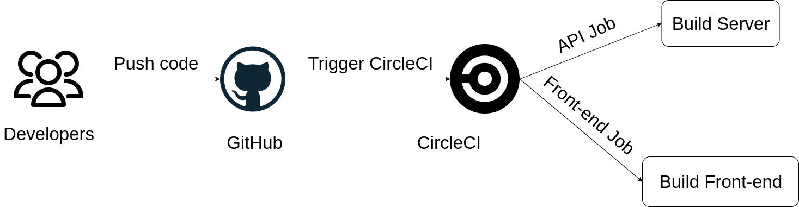

# Udagram Pipeline

## CI

- When a code is published to github a signal is triggered to CircleCI platform to start
- Then CircleCI reads the `.circleci/config.yml` and runs 2 jobs:
  - Build frontend
  - Build backend
- The jobs runs the `build` script provided in `package.json` then it deploys the code to AWS
